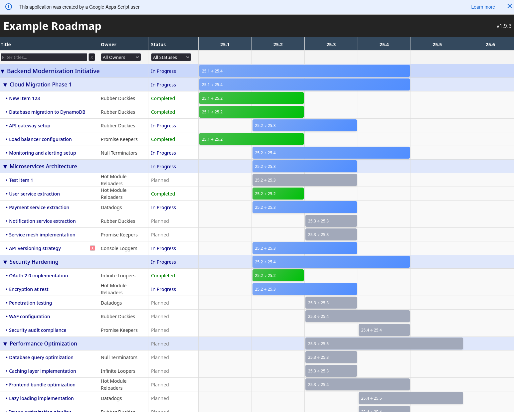

# Google Sheets + Svelte Roadmap

Deploy via Google Apps Script an intuitive, visually appealing roadmap (built with Svelte) leveraging data from Google Sheets.

Develop locally with sample json data and seamlessly deploy to Google Apps Script using [Clasp](https://developers.google.com/apps-script/guides/clasp).

Based on the [Svelte + Google Apps Script project](https://gitlab.com/fonner-development/svelte-google-apps-script)



## Features

- Visually displays duration bars for each roadmap item, colored by status
- Text fields can be edited inline by clicking on the fields
- Roadmap items can be moved and resized to adjust start and end dates
- Items can be filtered by goal, owner, and status
- Data is sourced from a Google Sheet and updates to the roadmap are saved back to the Google Sheet, avoiding the need for a custom database
- Can be deployed as a web app via Google Apps Script, avoiding need for any custom hosting

## Prerequisites

- Node.js installed on your machine
- A Google account
- Enable the Google Apps Script API at https://script.google.com/home/usersettings

## Developing

- `npm install` to install dependencies.
- `npm run dev` to start the development server.
- Open `http://localhost:5173` in your browser to see the app.
- Edit the Svelte components in the `src` folder. The app will reload automatically
- Data is loaded from the `roadmap-data.json` file during development.

## Building
- `npm run build` - Build the Svelte application
- `npm run preview` - Preview the production build locally
- `npm run check` - Run TypeScript and Svelte checks

## Deploying and Running

1. Create a new Google Sheet and import the [roadmap template](./public/google-sheet.csv)
1. Click on Extensions > Apps Script to open the Apps Script editor
1. Decide whether you will deploy manually or via Clasp and follow instructions below

After Deploying
1. In the Apps Script editor, click **Deploy** > **New deployment**
4. Select type **Web app**
5. Configure access settings as needed
6. Click **Deploy**
1. Visit the URL presented to see the deployed app

### Manual Deployment

1. Run `npm run build` to generate the content
1. Manually copy each file in the `gas` folder into the Apps Script editor

### Working with Clasp for automated deployment

#### Authenticate with Clasp

Login to your Google account:

```bash
npm run clasp:login
```

This will open a browser window for authentication.

#### Connect to your Apps Script project

1. Click the Settings icon on the left sidebar and copy the Script ID
1. In the project root, copy the `.clasp.json.example` to `.clasp.json` and replace `YOUR_APPS_SCRIPT_PROJECT_ID_FROM_SETTINGS` with your Script ID


#### Build and Deploy

Build your Svelte app and push to Google Apps Script:

```bash
npm run clasp:push
```

This command builds the project and pushes all files to your Apps Script project.

Run the deployment command to create a new deployment:

```bash
npm run clasp:deploy
```


#### Clasp Commands
- `npm run clasp:login` - Authenticate with Google
- `npm run clasp:logout` - Logout from Google
- `npm run clasp:create` - Create a new Apps Script project
- `npm run clasp:push` - Push code to Apps Script
- `npm run clasp:open` - Open the Apps Script project in browser
- `npm run clasp:deploy` - Create a new deployment
- `npm run clasp:deployments` - List all deployments
- `npm run deploy` - Build and push to Apps Script (recommended)


### Learn More

- [Clasp Documentation](https://developers.google.com/apps-script/guides/clasp)
- [Google Apps Script Documentation](https://developers.google.com/apps-script)
- [Svelte Documentation](https://svelte.dev/docs)

## Project Structure

```
.
├── gas/                     # Google Apps Script files
│   ├── appsscript.json      # Apps Script manifest
│   ├── Code.js              # Server-side Apps Script code
│   ├── Index.html           # Main HTML template
│   ├── Javascript.html      # Generated from build (auto-generated)
│   └── Stylesheet.html      # Generated from build (auto-generated)
├── src/                     # Svelte source files
│   └── lib/                 # Svelte components
├── .claspignore             # Files to ignore when pushing
└── .clasp.json              # Clasp configuration (gitignored)
```

